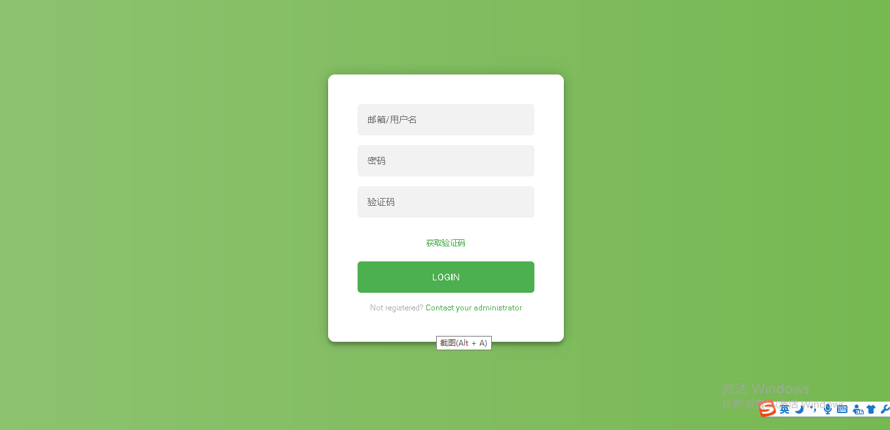
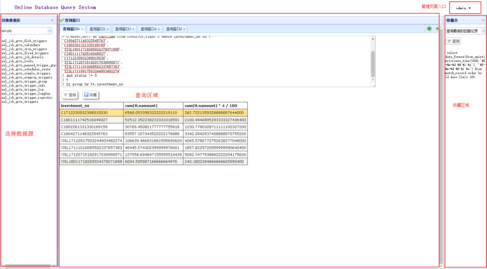
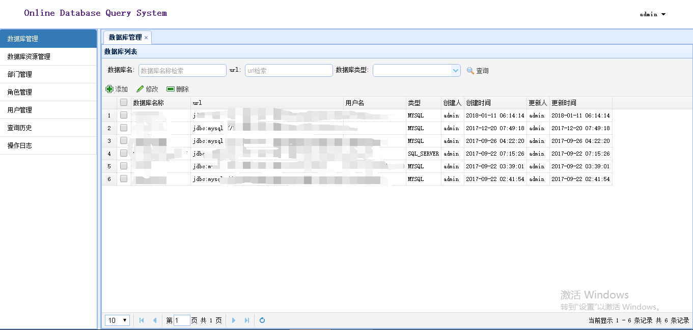
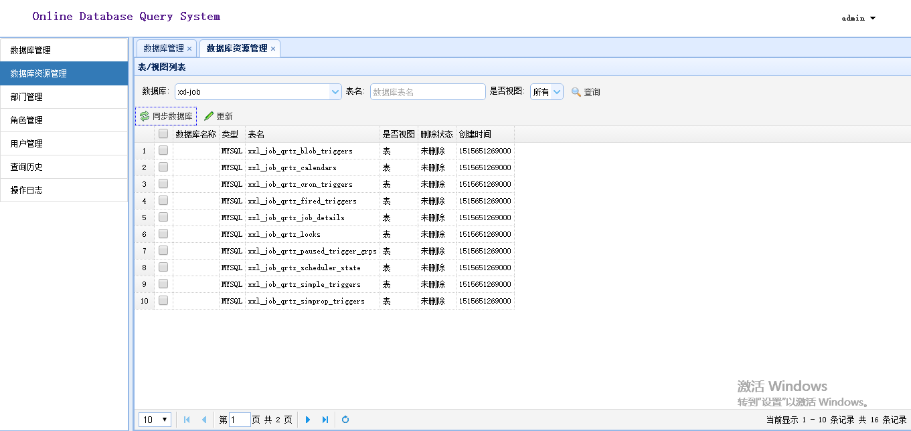
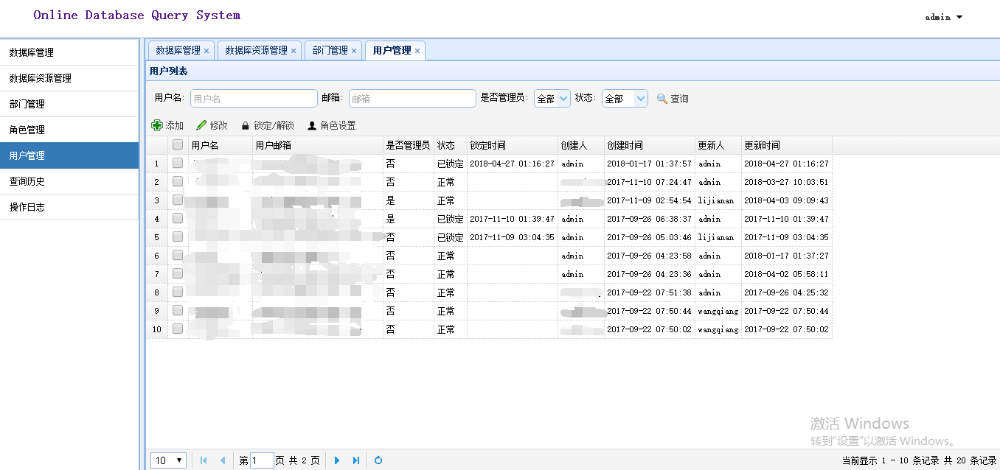
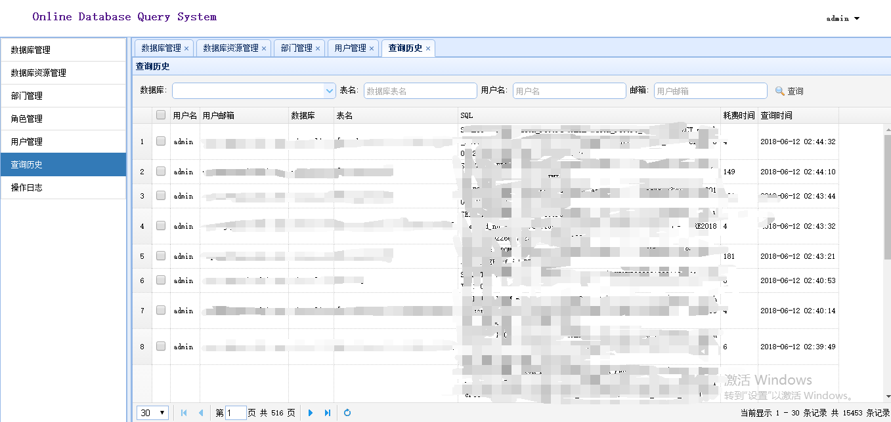
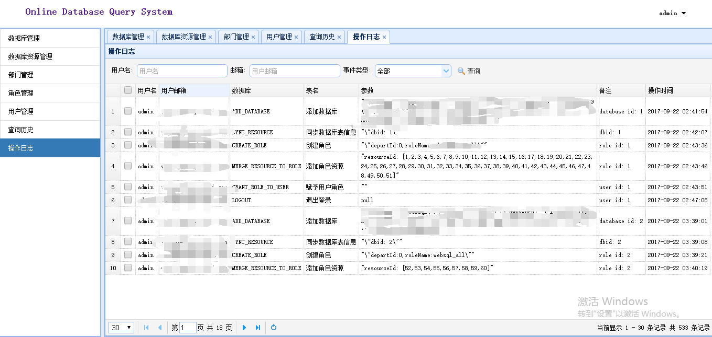

> websql 项目是一个线上数据库的查询、审计系统， 目前支持MySql和SqlServer。支持配置多个数据源。 比如微服务环境下，
有user服务和order服务的两个数据源， 可以把这个两个数据源一起配置在websql里面，查询的时候选择不同的数据源。 websql采用基本
的 资源-角色-用户的权限模型。 资源是具体到某一张表/视图。

安装说明
========

1. 下载源码包
2. 修改 `web/src/main/resource/config/application-local.properties`, 配置自己的数据库以及redis。 redis在本项目仅用作session共享。
3. 修改 `web/src/main/resource/config/application.properties`, 配置其中的邮件服务器。
4. 修改 `web/src/main/resource/initialize/data.sql`, 将 `admin@admin.com` 改为admin真正的邮箱。
5. 打包 `mvn clean package -DskipTests`。
6. 进入到target目录: `cd web/target`。
7. 运行jar包： `java -jar web-1.0-SNAPSHOT.jar`。
8. 访问地址 `http://localhost:8080`, 用户名密码为 `admin/Admin123`, 获取邮箱验证码, 输入之后即可登录!

**PS. websql依赖了`https://github.com/wupeng1988/global-session`, global-session没有发布到maven仓库， 需要clone此项目本地install。
如果单节点部署， 也可以不用此组件。**

软件截图
========

登录页

首页

数据库管理

表/视图管理

用户管理

查询历史

操作日志

